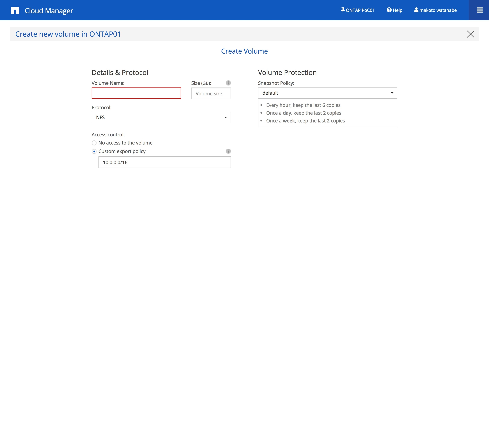
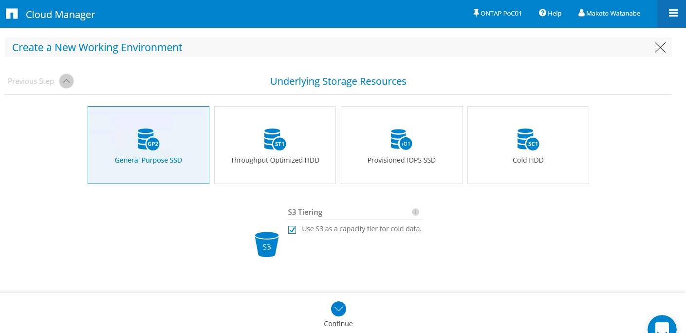

# AWS Hands-on：簡単NetApp Cloud Solution (ONTAP Cloud編) 

[TOC]

## 実施概要(ONTAP Cloud 編）
<!--
- フェーズ：awareness /Partner enablement
- 目標集客: 15 - 20 人(クラウドリソースの制限、エンドユーザ）
- 費用:12.5万（お弁当代除く）
-->

まずは「体験する」を目的とするハンズオンです。
細かい動作を確認するよりは **「なにができるのか」** を体験する内容です。
体験いただき、できることを確認してもらうのが本ハンズオンの目的です。

## 実施する完成形のシステム
今回のハンズオンの環境概要です。
VPC内部に２つのパブリックサブネットを準備し、各サブネット上にONTAP Cloud をデプロイします。

## Hands-on overview

- OnCommand Cloud Manager をデプロイする
- OTANP Cloud をデプロイする
- ONTAP Cloud の操作を行う

<!--
時間に余裕があれば以下のハンズオンを準備しています。
- CloudSync を使ってONTAP Cloud のNFSのデータから S3へデータを転送しRedShift で分析
- NPS からデータを参照し分析(NFSをデータソースとする）
-->

## OCCM のセットアップ
配布しているIPリストのOCCM欄のIPを確認ください。
アクセス時には

- https://IPアドレス

でアクセスできます。

OCCMの画面から「Storage System View」をクリックすると以下の画面になるので「Set up new Cloud Manager」をクリックします。

初期セットアップの画面が表示されます。

### サイト情報の入力

入力項目としては以下の２つとなります。

| 入力項目 |説明 |入力値 |
| --- | --- |--- |
| Site | 任意入力 |PoC|
| Company | 任意入力 |NetApp K.K.|

入力後、「Continue」をクリックしユーザ情報登録画面へ。

### ユーザ情報の登録

| 入力項目 | 説明|入力値 |
| --- | --- |--- |
| First Name | 名前 |ご自身のお名前|
| Last Name | 名字 |ご自身の名字|
| Email address(username) | ユーザ名として使用するメールアドレス |ご自身のメールアドレス|
| Password | 任意のパスワード |NetApp1!|

### AWS Permission 画面

| 入力項目 |説明|入力値 |
| --- | --- |--- |
| AWS Access Key | ユーザ作成時にダウンロードできるアクセスキー | ダウンロードファイルをご確認ください|
| AWS Secret Key | ユーザ作成時にダウンロードできるシークレットキー| ダウンロードファイルをご確認ください|
| AWS Cost S3 Bucket | オプション、課金レポートを保存するS3バケットを指定|今回は入力なし |

### テナントの作成

| 入力項目 | 説明|入力値 |
| --- | --- |--- |
| Name | テナント名|ONTAP PoC01|
| Description | 概要記入|今回は入力なし|
| Cost Center | コストセンター|今回は入力なし|

### NetApp サポートサイトの登録情報
| 入力項目 | 説明|入力値 |
| --- | --- |--- |
| NSS User ID | ネットアップサポートサイトID|今回は入力なし|
| NSS Password | サポートサイトのパスワード|今回は入力なし|

### 設定情報の確認

今までの設定情報の確認ページが表示されます。

「End User License Agreement」 を読み、承認したら「I have read 〜」にチェックを入れ、「Go」をクリック。

以上でOCCMの設定が完了します。
約5分で以下の画面になり、ONTAP Cloud をデプロイできるようになりました。

## ONTAP Cloud のデプロイ

 OCCM から ONTAP Cloud をAZ毎にデプロイします。

OCCMの画面の左上の Add Environmentをクリックします。

一番左のONTAP Cloudを選択しすると次の画面に遷移します。

| 入力項目 |説明| 入力値 |
| --- | --- |--- |
| Working Environment Name | 作業環境 | ONTAP01|
| Tag Key | 識別子 | PoC1|
| Password | パスワード|NetApp1!|
| ConfirmPassword | 確認用パスワード|NetApp1!|

「Add Tags」 は　AWS　のタグとして使用される、任意入力。

入力項目を入力後、「Continue」をクリック。

| 入力項目 |説明| 入力値 |
| --- | --- |--- |
| AWS region | デプロイするリージョン | Asia Pacific \| Tokyo を選択|
| VPC | デプロイするVPC| 10.0.0.0/16を選択| 
| SSH authentication method| SSH の認証方法 |Key Pair を選択|
|Key Pair| キーペア名| OTC を選択|

暗号化手法、今回は暗号化なしで実施「None」を選択

暗号化の種別は３つ

- NONE: なし
- ONTAP Cloud Manage: OCCMで鍵管理サーバを構築して暗号化を実施
- AWS 機能を使った暗号化

BYOLラインセンスを使用するかの選択、今回のハンズオンでは「No」を選択。

プレコンフィグレーションの画面に遷移。
今回は体験を目的としているため、「POC and 〜」を選択してデプロイします。

カーソルを載せると以下の画面になります。

持っていればサポートサイトのIDを入力。

| 入力項目 |説明| 入力値 |
| --- | --- |--- |
| Volume Name | 初期作成するボリューム名 | vol01|
| Size(GB) | 作成するボリュームのサイズ| 1| 
| Protocol| ONTAP Cloud で作成するシェアへのアクセスプロトコル |NFSを選択|
|Access control| 作成したボリュームにアクセスできるネットワーク| 変更なし、初期値でデプロイしたVPCのネットワークアドレスが指定されている|
|Snapshot policy| スナップショット取得の設定| 変更なし、初期値|
|Usage Profile|容量効率化を使うかの選択| 変更なし、Storage Efficiencyが設定されている|

「Continue」をクリック。

確認画面が表示されるので、それぞれのタブで情報を確認「Overview」, 「Networking」、「Storage」をクリックして内容をみます。

Overview画面

Networking画面

Storage画面
チェックボックスをチェックし、「Go」をクリック

ONTAP Cloud のデプロイが開始されます。
以下はデプロイ中に画面です。

Timelineタブから進捗を確認できます。。

約25分後にプロビジョニングが完了し以下の画面になります。

以上で ONTAP Cloud のデプロイが完了です。

## ONTAP Cloud の機能に触れてみる

一通り設定できる項目について確認します。
中心の雲をクリックすると以下のような画面になります。

### Volumeを追加する
「Add Capacity 」をクリックすると以下の画面になります。

以下の入力項目があります。
それぞれ入力し、「Continue」をクリックします。

| 入力項目 |説明 |入力値 |
| --- | --- |---|
| Volume Name | 作成するボリュームの名前 | vol02|
| Size (GB)  | 作成するボリュームのサイズ| 1 (GB) |
| Protocol | 使用プロトコル| NFS|
| AccessControl | アクセスできるネットワークを指定| 10.0.0.0/16 (自動生成)|

注意点: 最初のサイズの1000% までしかデフォルトでは拡張できません、1000% が最大値となります。

画面では使用するEBSのタイプを選択します。
ここでは「General Purpose SSD」を選択し、「Go」をクリックします。

ボリュームの作成が完了すると「Wokring Environment」画面に戻ります。
先程作成したボリュームを確認するため、中心にある「ONTAP01」の雲をクリックします。
以下の画面が右側に現れるので、「Resource」をクリックし存在するボリュームを確認します。

Resouce をクリックすると以下の画面が表示されるので、追加したボリュームが表示されていることを確認します。

ここからはボリュームへどのような操作ができるかを確認します。

以降の手順でいくつかピックアップして試します。

### FlexCloneを実行してみる
ボリューム一覧画面からクローンするボリュームにカーソルを当てるとメニューバーが表示されるのでクリックをします。今回はvol01を対象とします。

「clone」をクリックします。

以下の画面に遷移します。

| 入力項目 | 説明 | 入力値 |
| --- | --- |--- |
| Clone Volume Name | クローン後のボリューム名 | vol01_clone (初期設定）|

「clone」ボタンをクリックします。
クローンの速度が速いことを確認してください。
今回はデータが入っていない状況ですが、データが100GB, 1TB であっても同じ速度で実行できます。

クローンに成功するとボリューム一覧画面に戻ります。
「vol01_clone」がボリューム一覧に表示されていることを確認してください。

### SnapMirrorを試す！
非同期レプリケーション機能であるSnapMirrorを設定します。
SnapMirrorの使い所としては、AZ 間のデータ保護、災害対策用に遠隔地に保管するといった使い方が可能です。

また、オンプレミスとAWS 間でもSnapMirrorでデータをレプリケートできるためオンプレミスの災害対策先としてAWSを選択することも可能になります。

#### SnapMirrorのデータ転送先のONTAP Cloud （２つ目）をデプロイする
「Working Environments」タブをクリックし以下の画面に戻ります。

「Add environment」をクリックし２つ目のONTAP Cloudをデプロイします。

| 入力項目 | 説明 | 入力値 |
| --- | --- |--- |
| Working Environment Name | 作業環境 | ONTAP02|
| Tag Key | 識別子 | PoC2|
| Password |パスワード | NetApp1! |
| Confirm Password |確認用パスワード | NetApp1! |

「Continue」をクリック

| 入力項目 | 説明 | 入力値 |
| --- | --- |--- |
|AWS  region  | デプロイするリージョン | Asia Pacific  \| Tokyo |
| VPC | デプロイするVPC | 10.0.0.0/16 |
| Subnet | デプロイするSubnet| 10.0.1.0/24 | 
| Security Group | 適応するSecurityGroup | Use a generated security group (自動生成) | 
| SSH authentication method | SSH認証の方法 | Key Pair | 
| Key Pair | 使用するKey Pair| OTC | 

「Continue」をクリック。

暗号化方式の選択、「NONE」を選択。

「Continue」をクリック

BYOLライセンスを使用するか、「No」を選択

ONTAP Cloud のエディションを選択、一番左の「Poc and small workloads」をクリック。

ネットアップサポートサイトの認証情報、今回は何も入力せずに「Continue」をクリック。

ボリュームの作成は「Skip」。

確認画面で、チェックボックスにチェックをいれ「Go」をクリック。

デプロイ完了後に実施 (約25分)
以上でSnapMirrorの準備が整いました。

#### SnapMirrorの設定をする
Working Environments の画面で操作をします。
右側のONTAP01 をドラッグして、左側のONTAP02にドロップします。

送信元となるONTAP01のボリュームを選択する画面になります。
ここでは「vol01」をクリックします。

次に送信先となるONTAP02 の設定になります。
送信先のボリューム作成画面になります。
ここでは「General Purpose SSD」を選択します。

「Continue」をクリックします。

転送速度のMax値を指定します。今回は特に指定せずそのまま「Continue」をクリックします。

データをミラーするのか、バックアップするかの選択画面となります。
今回はミラーの設定とするため、左側の「Mirror」を選択します。

ミラーのスケジュールが可能です、今回は一度のみのコピーとします。
「One-time copy」を選択します。

次の画面に遷移し、今まで設定した内容の確認画面となります。
内容が確認できたらチェックボックスにチェックを入れ「Go」をクリックします。

SnapMirrorの関係、データの転送を実行中の際には以下のような画面になります。

進捗状況は 「TImeline」から確認できます。

SnapMirror実施中はStatus欄が「In Progress」で表示されます。

SnapMirror関係、データ転送が完了すると Status 欄が「Complete」となります。

「Replication Status」をクリックするとSnapMirrorの状況を確認することができます。

SnapMirrorはドラッグ＆ドロップで実現することが可能です。

<!-- TODO phase 2 対応
## NPSを触ってみる

- CloudManager から接続

### Discover で NetApp Private Storage の LIF 
-->

### サーバからマウント
#### サーバのマウントコマンドの確認

Working EnvironmentsからONTAP01をクリックし、QuickNavigationから「Resources」を選択します。
ONTAP01のVolume 一覧画面から vol01のメニューを表示します。

その中から 「Mount Command」をクリックするとNFSであればサーバから実施するマウントコマンドを確認可能です。

### まとめ
以上で ONTAP Cloud    を実際触ってみるハンズオンでした。

以下のことを本ハンズオンでは実施しました。

-  OnCommand Cloud Manager (OCCM) のデプロイ
-  ONTAP Cloud のデプロイ
-  ONTAP Cloud でのボリュームの作り方
-  FlexCloneの仕方
- SnapMirrorの実施方法

今回はまずは触ってみるをテーマとしていますので、
もう少し触ってみたい、GUIからではなくAPIでやりたい、細かい使い方を知りたいという方はぜひご連絡いただければと思います。

<!--
## CloudSyncをためす！
Working Environments から ONTAP01をクリックし、、右の「Resources」→遷移後に「Sync to S3」をクリックします。
- なにができるか
- これまでのHands-onで作ったONTAP Cloud NFS -> S3
- S3 bucket は作成する
- S3 data lake architecture のファミリー（分析系がいいとおもう）
-->

## Appendix
本ハンズオンを実行するための事前準備をAppendixとしました。

### AWS VPC 設計
今回はハンズオンのため簡易的なネットワーク設計としています。

### AWS環境の作成 

- CloudFormation提供 作成・削除
- VPC/NAT gateway
- Jumphost/Linux hosts

### OnCommand Cloud manager のデプロイ

AWS Marketplace から OnCommand Cloud Manager をデプロイ
- https://aws.amazon.com/marketplace/pp/B018REK8QG

「Continue」 をクリック

「Launch with 1Click」をクリックすると OnCommand Cloud Manager のデプロイが開始されます。

EC2 コンソールページに移動して状況を確認します。

起動が完了したらわかりやすいように名前をOCCMと変更します。

### CloudManager IP の確認

EC2コンソールから対象のCloudManager をクリックします。下部のインスタンス情報にプライベートIP、パブリックIPが記載されます。本ハンズオンでは、CloudManager へ直接アクセスできるように設定をしています。（参考: Appendix: EIPを設定する）

OCCMのIPアドレス：(メモ）

操作しているブラウザから上記でメモしたIPにアクセスします。

https://_IPアドレス_　をブラウザで起動
以下のような画面が表示されればデプロイ完了です。

### 管理画面

#### Tabular View

#### Write Speed

#### ボリュームの追加

#### インスタンスの一覧

#### CloudSync のラインセンス確認
ラインセンス確認

#### 注意点/Tips
- volumeの拡張は初期サイズの10倍まで
- システム時間がデフォルトはUTC なのでSystemManagerで日本時間へ変更する

#### Key Pair 作成

pemファイルがダウンロードされるので大事に保管してください。今後の構築に使用します。

#### EIPを設定する

Actions -> Associate addressを選択

NetworkInterfaceに対してEIPを設定

EIPを確認、左のメニュー「Instances」からOCCMを選択
Elastic IP を確認

#### CloudFormationを実行する
本ハンズオンで使用するネットワーク構成はCloudFormationとして提供しています。
以下のURLからダウンロードして、CloudFormationを実行するとVPCの作成を実施します。

<!--
#### Pre confiugration 以外の方法
Create my own configuration だと任意のライセンスタイプやインスタンスタイプを選択可能

 

-->

